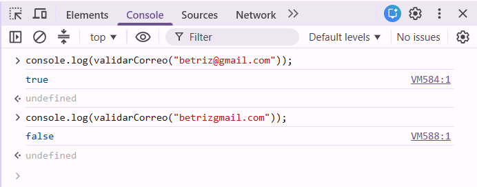
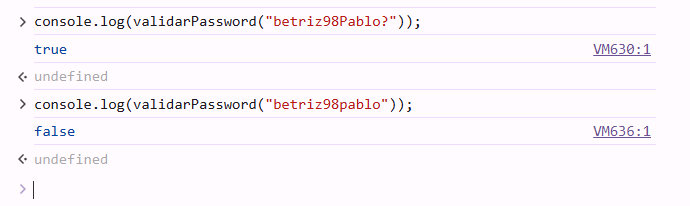
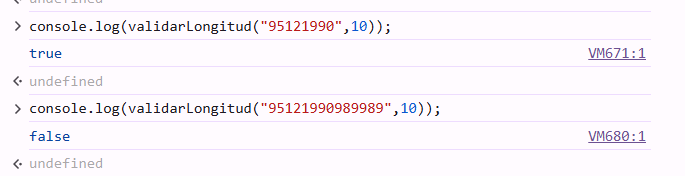
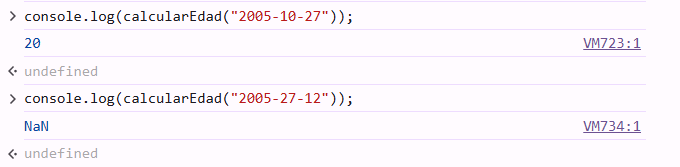
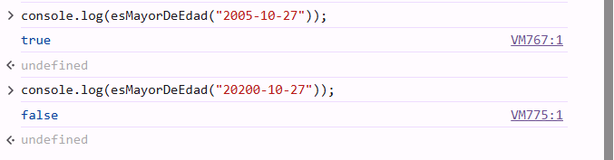
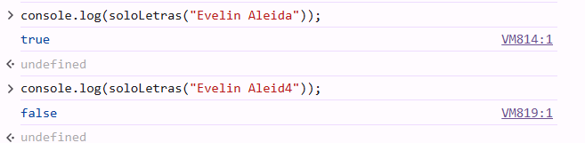
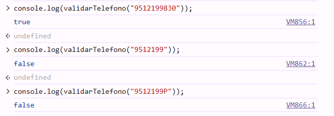
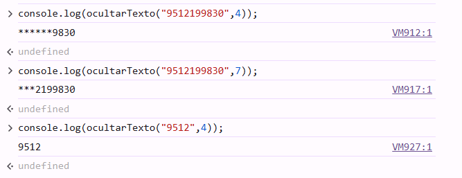

# UtileriaJS — Librería de Validaciones Web

---

## Portada

* **Proyecto:**  Librería utileria.js
* **Librería:** `utileria.js` 
* **Autor:** Evelin Aleida Pablo Delgado
* **Problema que resuelve:** Permite validar datos de formularios en el cliente como correos, contraseñas, teléfonos y edades de manera centralizada en un solo archivo reusable, evitando código duplicado y **eliminando la necesidad de instalar paquetes o frameworks pesados**.

---
## Evidencias de consola
En la siguiente carpeta se encuentran las capturas de pruebas realizadas en consola de las funciones que tiene la utileria
### 1.validarCorreo
### 1. validarCorreo


### 2. validarPassword


### 3. validarLongitud


### 4. calcularEdad


### 5. esMayorDeEdad


### 6. soloLetras


### 7. validarTelefono


### 8. ocultarTexto



## Video
El siguiente video es una explicacion breve de lo que es este proyecto y de como funciona desde navegador
 [Ver Video Demo](https://www.loom.com/share/d8a47a0f39c944759baf3ec1b33decbf)

## Instalación

Para utilizar la librería en cualquier proyecto web, descarga el archivo `utileria.js` e inclúyelo en tu archivo HTML antes del cierre de la etiqueta `</body>`:
```html
<script src="js/utileria.js"></script>